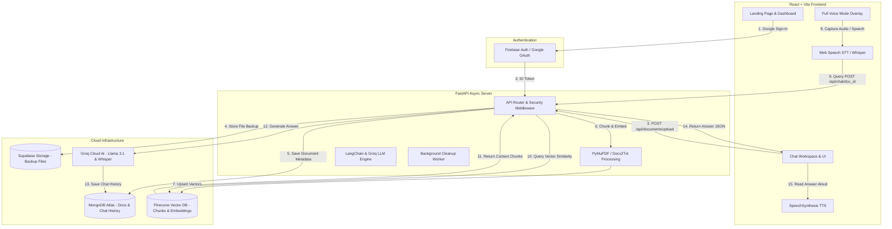

# RAGify AI

> **Conversational Document Intelligence & Full-Duplex Voice Assistant**  
> *Upload PDFs, DOCX files, or TXT documents and query them instantly using RAG and interactive voice mode with source transparency.*


---

## 📌 Overview

**RAGify AI** is a modern full-stack Retrieval-Augmented Generation (RAG) platform designed to eliminate document reading friction. Users can upload documents (PDF, DOCX, TXT), ingest their contents into a vector database, and ask questions in natural language.

### Key Capabilities
- **Document Q&A with Zero Hallucination**: Answers are synthesized strictly from retrieved document passages using Groq's high-speed Llama 3.1 model.
- **ChatGPT-Style Voice Mode**: Full-duplex interactive voice interface supporting continuous conversation, speech-to-text, text-to-speech, and barge-in / interruption controls.
- **GPU-Accelerated Landing Page**: Distinctive interactive water-ripple hero section rendered with Three.js ping-pong fragment shaders.
- **Privacy & Security**: Enforces user-isolated database collections, Pinecone vector metadata filtering, rate limiting, and zero exposure of raw chunks in the chat display.

---

## ✨ Features

### 🔐 Authentication
- **Firebase Google Authentication**: One-tap popup login and persistent session state via `onAuthStateChanged`.
- **Backend Token Validation**: Secure custom dependency (`get_current_user`) verifying Firebase Bearer ID tokens on protected API endpoints.
- **MongoDB User Sync**: Automatic synchronization of user profiles (`firebase_uid`, `email`, `displayName`, `photoURL`) upon login.

### 📄 Document Management
- **Multi-Format Support**: Upload PDF, DOCX, or TXT files up to 10 MB.
- **Automated Text Extraction**: Extracted using PyMuPDF (PDF), docx2txt (DOCX), and native UTF-8 decoding (TXT).
- **Document Lifecycle**: List user documents, track indexing status (`processing`, `ready`, `failed`), and delete documents with automatic cascade cleanup (removes MongoDB record, Supabase backup file, and Pinecone vectors).
- **Document Retention Expiry**: Automated cleanup service purging expired documents based on configured retention policies.

### 🧠 RAG & AI Pipeline
- **Smart Chunking**: Recursive character text splitting (1,000 character chunks with 200 character overlap).
- **HuggingFace Embeddings**: Local high-speed vector embeddings via `sentence-transformers/all-MiniLM-L6-v2`.
- **Pinecone Vector Database**: Document chunks indexed into isolated namespaces with `user_id` metadata filtering.
- **Contextual Answer Generation**: Groq Llama 3.1 8B Instant model generates humanized, natural responses grounded in retrieved context.
- **Security Policy**: Custom safety instructions allowing educational cybersecurity discussions while rejecting malicious exploitation requests.

### 🎙️ Full-Duplex Voice Assistant
- **Hands-Free Interactive Interface**: Centered glassmorphic overlay for continuous voice conversation.
- **Speech Recognition**: Web Speech API with automatic fallback to Groq Whisper (`POST /api/speech/transcribe`) for low-confidence or silent browser STT.
- **Natural Text-to-Speech**: SpeechSynthesis API with preferred natural voice selection and clean plain-text parsing.
- **Exact "STOP" Command**: Say `"stop"`, `"stop please"`, `"please stop"`, or `"okay stop"` to immediately halt TTS playback without hitting the RAG pipeline.
- **Barge-In / Interruption Support**: Interrupt ongoing AI voice playback at any time to ask follow-up questions.
- **AudioContext Lifecycle Safety**: Single-instance AudioContext management preventing `InvalidStateError` exception loops.

---

## 🏗️ System Architecture



---

## 🔄 How RAG Works

```text
User File Upload (PDF/DOCX/TXT)
      ↓
File Validation (MIME & 10MB Size Check)
      ↓
Text Extraction (PyMuPDF / Docx2Txt / UTF-8)
      ↓
Recursive Character Splitting (1000 chars, 200 overlap)
      ↓
HuggingFace Embedding Generation (all-MiniLM-L6-v2)
      ↓
Pinecone Index Upsert (Namespace = Document ID, Metadata = User ID)
      ↓
User Asks Question (Chat UI or Voice Mode)
      ↓
Query Vectorization & Similarity Search (Top-k = 5, Filter = user_id)
      ↓
Token-Capped Context Assembly (Tiktoken cl100k_base <= 12,000 tokens)
      ↓
Groq Llama 3.1 Execution (Grounded Conversational System Prompt)
      ↓
Answer Returned to Frontend & Saved to MongoDB History
```

---

## 🎙️ Voice Assistant Architecture

```text
User Clicks Microphone Button
        ↓
Full Voice Mode Overlay Opens
        ↓
Hardware-Filtered MediaRecorder & Web Speech STT Start
        ↓
User Speaks Question (e.g. "What is this document about?")
        ↓
Speech Recognized -> Text Finalized
        ↓
Is Stop Command? ("stop" / "please stop")
    ├── YES ➔ Stop SpeechSynthesis & Return to Listening
    └── NO  ➔ Forward Text to RAG API Endpoint (POST /api/chat/{id})
        ↓
Groq Generates Natural Answer
        ↓
SpeechSynthesis Converts Text to Speech
        ↓
AI Voice Speaks Answer
        ↓
Automatic Transition Back to Listening Mode for Follow-Up Questions
```

---

## 🧰 Technology Stack

### Frontend
- **Framework**: React 18, Vite 8, React Router v7
- **Styling**: Tailwind CSS v4, Lucide React Icons
- **3D Graphics & Shaders**: Three.js (r185) for GPU ping-pong water ripple hero
- **HTTP Client**: Axios with Bearer Token request interceptors
- **Markdown & Speech**: `react-markdown`, Web Speech API (`SpeechRecognition`, `SpeechSynthesis`)

### Backend
- **Framework**: FastAPI (Python 3.11+), Uvicorn ASGI Server
- **Validation & Settings**: Pydantic v2, `pydantic-settings`
- **Rate Limiting**: `slowapi` (IP and User-based bucket rate limiters)
- **Document Parsing**: PyMuPDF (`fitz`), `docx2txt`, BeautifulSoup4

### Database, Storage & AI Infrastructure
- **Authentication**: Firebase Admin SDK (ID Token Verification)
- **Primary Database**: MongoDB Atlas via Motor (Async Python Driver)
- **Vector Database**: Pinecone Vector DB (`pinecone-client`)
- **Cloud Storage**: Supabase Storage (`supabase-py`)
- **Orchestration Framework**: LangChain, `langchain-community`, `langchain-groq`
- **Embeddings & LLM**: HuggingFace `sentence-transformers/all-MiniLM-L6-v2`, Groq `llama-3.1-8b-instant`, Groq Whisper

---

## 📁 Project Structure

```text
RAGify-PROJECT/
├── backend/
│   ├── app/
│   │   ├── core/
│   │   │   ├── config.py             # Pydantic settings & env variables
│   │   │   ├── rate_limiter.py       # Slowapi rate limiters
│   │   │   └── security.py           # Firebase bearer token dependency
│   │   ├── db/
│   │   │   └── mongo.py              # Async MongoDB Motor connection
│   │   ├── models/                   # Pydantic database models
│   │   ├── rag/
│   │   │   ├── chains.py             # Groq LLM & LangChain setup
│   │   │   ├── ingestion.py          # Document loaders & chunking
│   │   │   └── vectorstore.py        # Pinecone vectorstore factory
│   │   ├── routes/
│   │   │   ├── admin_routes.py       # Admin retention cleanup
│   │   │   ├── auth_routes.py        # Account sync endpoints
│   │   │   ├── chat_routes.py        # RAG query & history endpoints
│   │   │   ├── dashboard_routes.py   # Stats & document counts
│   │   │   ├── document_routes.py    # Document upload, list, delete
│   │   │   ├── speech_routes.py      # Groq Whisper fallback STT
│   │   │   └── user_routes.py        # Profile details
│   │   ├── schemas/                  # Request & response validation
│   │   ├── services/                 # Firebase, Supabase, cleanup workers
│   │   ├── main.py                   # FastAPI app entry & CORS middleware
│   │   └── utils.py
│   ├── requirements.txt              # Python backend dependencies
│   ├── run_verification_tests.py     # Backend test suite
│   └── .env.example
│
├── frontend/
│   ├── src/
│   │   ├── components/
│   │   │   ├── chat/                 # ChatBox, MessageBubble, VoiceMode
│   │   │   ├── dashboard/            # StatCard, RecentDocuments
│   │   │   ├── hero/                 # WaterRippleHero (Three.js Shader)
│   │   │   ├── landing/              # Hero, Features, Workflow, CTA
│   │   │   ├── layout/               # Navbar, Sidebar, ProtectedRoute
│   │   │   └── upload/               # FileDropzone, UploadProgress
│   │   ├── context/
│   │   │   └── AuthContext.jsx       # Firebase state & auth provider
│   │   ├── pages/                    # LandingPage, ChatPage, UploadPage, etc.
│   │   ├── services/
│   │   │   ├── api.js                # Axios instance & transcribeAudio helper
│   │   │   └── firebase.js           # Firebase Web SDK initialization
│   │   ├── index.css                 # Global CSS & Tailwind v4 theme
│   │   ├── main.jsx                  # React application root
│   │   └── router.jsx                # React Router v7 routes
│   ├── package.json                  # Node.js dependencies & scripts
│   ├── vite.config.js                # Vite build & proxy settings
│   ├── vercel.json                   # Vercel SPA rewrite deployment config
│   └── .env.example
│
├── render.yaml                       # Render Web Service deployment blueprint
├── .gitignore
└── README.md
```

---

## ⚙️ Installation & Setup

### Prerequisites
- **Python**: 3.11 or higher
- **Node.js**: v18.0.0 or higher
- **Services Required**:
  - MongoDB Atlas Cluster
  - Firebase Project with Google Auth enabled
  - Pinecone Index (`dimension: 384`, `metric: cosine`)
  - Supabase Storage Bucket (`ragify-files`)
  - Groq API Key

---

### Backend Setup

1. **Navigate to backend directory**:
   ```bash
   cd backend
   ```

2. **Create and activate virtual environment**:
   ```bash
   # Windows
   python -m venv .venv
   .venv\Scripts\activate

   # Linux/macOS
   python3 -m venv .venv
   source .venv/bin/activate
   ```

3. **Install backend dependencies**:
   ```bash
   pip install -r requirements.txt
   ```

4. **Create environment file**:
   Copy `.env.example` to `.env` and fill in credentials:
   ```bash
   cp .env.example .env
   ```

5. **Start FastAPI development server**:
   ```bash
   uvicorn app.main:app --reload --host 0.0.0.0 --port 8000
   ```

---

### Frontend Setup

1. **Navigate to frontend directory**:
   ```bash
   cd frontend
   ```

2. **Install Node dependencies**:
   ```bash
   npm install
   ```

3. **Create environment file**:
   Copy `.env.example` to `.env`:
   ```bash
   cp .env.example .env
   ```

4. **Start Vite development server**:
   ```bash
   npm run dev
   ```

---

## 🔐 Environment Variables

### Backend (`backend/.env`)

| Variable | Description | Secret? |
| :--- | :--- | :---: |
| `PORT` | Local FastAPI port (default `8000`) | No |
| `FRONTEND_URL` | Allowed CORS origin (e.g. `http://localhost:5173`) | No |
| `DOCUMENT_RETENTION_DAYS` | Auto-expiry threshold in days (default `15`) | No |
| `ADMIN_SECRET` | Header token for `/api/admin/cleanup` endpoint | **YES** |
| `MONGODB_URI` | MongoDB Atlas connection string | **YES** |
| `MONGO_TLS_INSECURE` | Set `false` for production | No |
| `FIREBASE_PROJECT_ID` | Firebase project identifier | No |
| `FIREBASE_CLIENT_EMAIL` | Firebase Service Account email | **YES** |
| `FIREBASE_PRIVATE_KEY` | Firebase Service Account private key | **YES** |
| `PINECONE_API_KEY` | Pinecone database API key | **YES** |
| `PINECONE_INDEX_NAME` | Pinecone index name (e.g. `ragify-index`) | No |
| `SUPABASE_URL` | Supabase project URL | No |
| `SUPABASE_SERVICE_ROLE_KEY` | Supabase Service Role Key | **YES** |
| `SUPABASE_BUCKET` | Supabase storage bucket name (default `ragify-files`) | No |
| `GROQ_API_KEY` | Groq API key | **YES** |
| `GROQ_MODEL` | Groq LLM model ID (`llama-3.1-8b-instant`) | No |
| `EMBEDDING_MODEL` | HuggingFace embedding model ID | No |

### Frontend (`frontend/.env`)

| Variable | Description | Secret? |
| :--- | :--- | :---: |
| `VITE_API_URL` | Backend URL (e.g. `http://localhost:8000`) | No |
| `VITE_FIREBASE_API_KEY` | Public Firebase Web API key | Public |
| `VITE_FIREBASE_AUTH_DOMAIN` | Public Firebase Auth domain | Public |
| `VITE_FIREBASE_PROJECT_ID` | Public Firebase Project ID | Public |
| `VITE_FIREBASE_STORAGE_BUCKET` | Public Firebase Storage bucket | Public |
| `VITE_FIREBASE_MESSAGING_SENDER_ID` | Public Firebase Sender ID | Public |
| `VITE_FIREBASE_APP_ID` | Public Firebase Web App ID | Public |

---

## 🔌 API Documentation

| Method | Endpoint | Description | Auth Required |
| :--- | :--- | :--- | :---: |
| `GET` | `/api/health` | Backend status & MongoDB check | No |
| `POST` | `/api/auth/sync` | Sync Firebase user profile to MongoDB | Yes (Bearer) |
| `GET` | `/api/documents` | List all documents belonging to current user | Yes (Bearer) |
| `POST` | `/api/documents/upload` | Upload & ingest document (PDF/DOCX/TXT) | Yes (Bearer) |
| `GET` | `/api/documents/{id}` | Get document metadata by ID | Yes (Bearer) |
| `DELETE` | `/api/documents/{id}` | Purge document, backup file, and vectors | Yes (Bearer) |
| `POST` | `/api/chat/{document_id}` | Query document via RAG pipeline | Yes (Bearer) |
| `GET` | `/api/chat/{document_id}/history` | Fetch conversation history for document | Yes (Bearer) |
| `POST` | `/api/speech/transcribe` | Transcribe audio blob via Groq Whisper | Yes (Bearer) |
| `GET` | `/api/dashboard/stats` | Fetch aggregate user stats & recent docs | Yes (Bearer) |
| `GET` | `/api/users/me` | Fetch authenticated user profile | Yes (Bearer) |
| `POST` | `/api/admin/cleanup` | Trigger purge of expired documents | Yes (`X-Admin-Token`) |

---

## 🛡️ Security Implementation

- **Authentication & Token Verification**: All private routes validate Firebase Bearer ID tokens on every request.
- **IDOR Protection**: All document, chat, and vector operations strictly enforce `{"user_id": current_user['id']}` filters.
- **Rate Limiting**: Configured using `slowapi` to prevent abuse on upload (5/min) and chat (30/min) endpoints.
- **CORS Restrictions**: Configured via `CORSMiddleware` using explicit `FRONTEND_URL` settings (no wildcard origins for credentials).
- **Service Isolation**: Privileged credentials (Supabase Service Role Key, Firebase Private Key, Groq API Key) reside exclusively on the backend.

---

## 🧪 Testing & Verification

Run the comprehensive backend test suite:
```bash
cd backend
python run_verification_tests.py
```

### Verification Checks Performed
- Backend Health Endpoint (`/api/health`)
- Authentication Token Interception & Sync
- Document Validation & Upload Processing
- Vector Embedding & Pinecone Indexing
- Grounded RAG Query Execution
- Speech Transcription Fallback

---

## 🚀 Production Deployment

### Backend Deployment (Render)
- Deploy using [render.yaml](file:///c:/Users/ANUSHITHA%20R/OneDrive/Desktop/RAGify%20PROJECT/render.yaml) blueprint.
- **Root Directory**: `backend`
- **Build Command**: `pip install -r backend/requirements.txt`
- **Start Command**: `uvicorn app.main:app --host 0.0.0.0 --port $PORT`

### Frontend Deployment (Vercel)
- Deploy using [frontend/vercel.json](file:///c:/Users/ANUSHITHA%20R/OneDrive/Desktop/RAGify%20PROJECT/frontend/vercel.json).
- **Framework Preset**: `Vite`
- **Build Command**: `npm run build`
- **Output Directory**: `dist`
- **Environment Variable**: Set `VITE_API_URL` to your live Render backend URL.

---

## 📋 Production Checklist

- [x] Backend verification suite passes 100% (`run_verification_tests.py`).
- [x] Frontend builds cleanly without error (`npx vite build`).
- [x] `.env` files protected by `.gitignore`.
- [x] SPA routing fallback configured (`vercel.json`).
- [x] Full-duplex Voice Mode AudioContext safety verified.
- [ ] Add Vercel production domain to **Firebase Console ➔ Authorized Domains**.
- [ ] Add Render outbound IPs to **MongoDB Atlas ➔ Network Access**.

---

## ⚠️ Known Limitations

- **Web Speech Recognition**: Speech-to-text accuracy in browser mode relies on Web Speech API support (Google Chrome & Microsoft Edge recommended).
- **Audio Device Access**: Voice mode requires active microphone permissions in browser settings.
- **Free Tier Cold Starts**: Initial API latency may increase slightly on free server tiers when spinning up idle containers.

---

## 📄 License

License: Not specified
